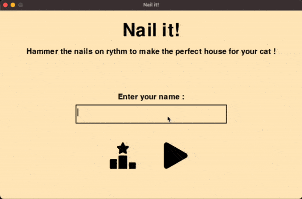

# Nail it !

> A remake of the popular osu! beatmap *"Hammer Time"* made with pygame.

## Table of Contents

1. [Features](#features)  
2. [Demo](#demo)  
3. [Getting Started](#getting-started)  
4. [Installation](#installation)  
5. [Usage](#usage)  
6. [Troubleshooting](#troubleshooting)

## Features

- Responsive Gameplay: Enjoy smooth and responsive gameplay recreated from the osu! beatmap.
- Arduino Integration: Play the game using a microcontroller, allowing for unique input options.
- Player logging
- Leader board

## Demo



[**Click here**](./assets/md/long_demo.mov) to see the full demo.

## Getting Started

### Prerequisites

#### Software

- Python 3.x
- Pygame
- PySerial

#### Hardware (Optional)

- Arduino or compatible microcontroller

## Installation

Clone the repository:
```bash
git clone https://github.com/stantonik/ComputerSci/tree/main/week3/nailit
cd nailit
```

To setup a virtual python environnement and install requirements, just run
```bash
make init
```

*(optional)* Upload the Arduino code using Arduino IDE or other tools

## Usage

1. Launch  the game.
```bash
make start 
```
2. Use the space bar (or you controller) to hit the nail with the hammer on rhythm.
3. Enjoy !

## Troubleshooting

#### Serial Connection Issues:

- Make sure your COM port is correctly set in the Python script.
Ensure the baud rate matches between the Python and Arduino code.

#### Pygame Not Responding:

- Verify that Pygame is installed correctly and compatible with your Python version.
Ensure the code is running in a supported environment (e.g., no hardware acceleration conflicts).
